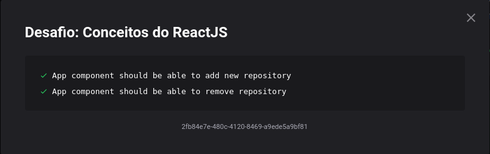
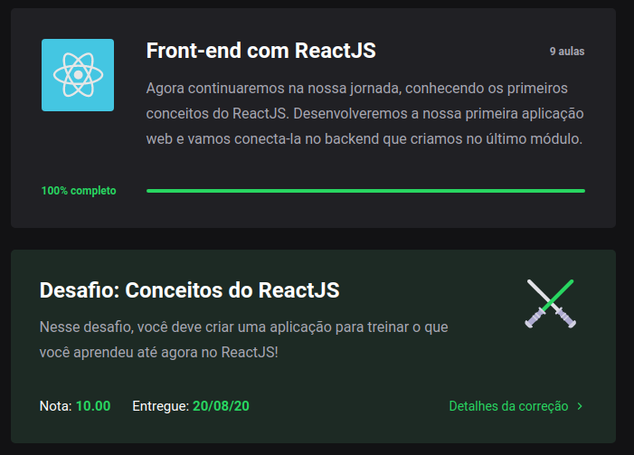

<h1 align="center">
  Desafio 03: Conceitos ReactJS
</h1>

<blockquote align="center">“Faça seu melhor, mas sempre com prazo de entrega”!</blockquote>

## Sobre o desafio 💪
Terceiro desafio do GoStack 13.0! 🚀  
Nesse, fizemos um front-end que era capaz de listar,criar e deletar repositorios do nosso backend feito no desafio 02. 
Deu para aproveitar o uso do controle de estado do React nesse desafio, já que ao deletar ou criar novos repositorios era atualizado em tempo real, sem reload e sem chamadas adicionais para a API. 🚀  
Foi usado o Jest (uma estrutura de testes criada pelo Facebook) para realizar os testes e ver se passamos no desafio, os testes eram os seguintes 🛠  
</img>
Para mais detalhes sobre o desafio e que era precisa ser feito para ser passado em cada teste, você pode ver neste <a href="https://github.com/rocketseat-education/bootcamp-gostack-desafios/tree/master/desafio-conceitos-reactjs">link</a>.

## 2/2 Testes Concluídos 🎯
Consegui passar em todos, e isso me garantiu uma nota 10.00 nesse desafio. 😀
</img>
